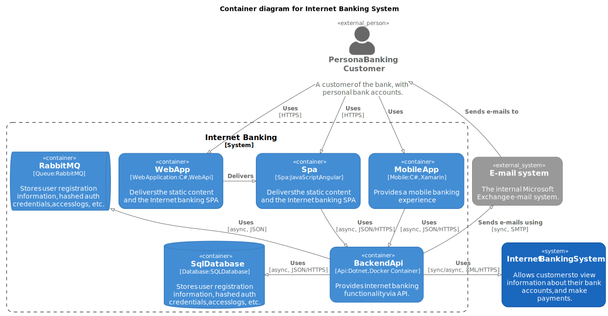
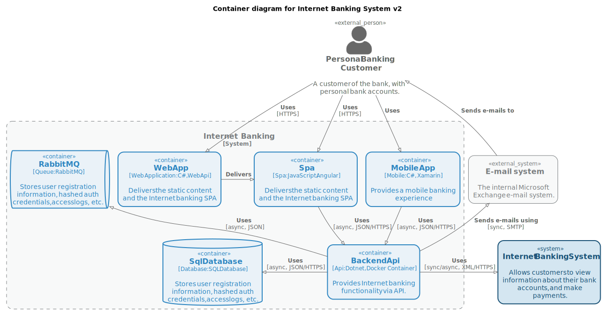
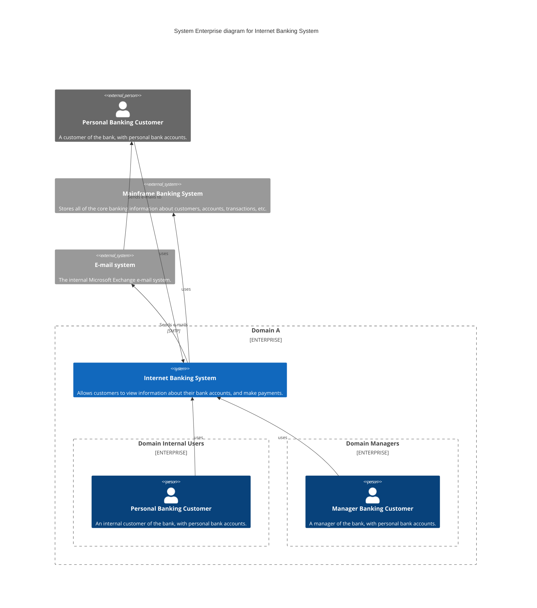

<p align="center">
  
</p>

C4Sharp (`C4S`) is a .net library for building diagrams as code, based on [C4 Model](https://c4model.com/). It works
like a superset of [C4-PlantUML](https://github.com/plantuml-stdlib/C4-PlantUML) through which developers can create,
share, and consume [C4 Model diagrams](https://c4model.com/) as code (C#) such as Context, Container, Component and
Deployment diagrams. The library generates the following diagram types: PNG, SVG, PUML, MERMAID

>[!NOTE]\
> The C4 model is an easy-to-learn, developer-friendly approach to software architecture diagramming. Good software architecture diagrams assist with communication inside/outside of software development/product teams, efficient onboarding of new staff, architecture reviews/evaluations, risk identification (e.g. risk-storming), threat modeling (e.g. STRIDE/LINDDUN), etc.  
> [SIMON BROWN](https://twitter.com/simonbrown)

>[!IMPORTANT]
> There are benefits to using these tools over the heavier alternatives, including easy version control and the ability to generate the DSLs from many sources. ools in this space that we like include Diagrams, Structurizr DSL, AsciiDoctor Diagram and stables such as WebSequenceDiagrams, PlantUML and the venerable Graphviz. It's also fairly simple to generate your own SVG these days, so don't rule out quickly writing your own tool either. One of our authors wrote a small Ruby script to quickly create SVGs, for example.    
> [Thoughtworks Technology Radar](https://www.thoughtworks.com/en-br/radar/techniques/diagrams-as-code)

## Getting Started

First, you will need the [.NET 5.0+](https://docs.microsoft.com/pt-br/dotnet/standard/net-standard)
and [Java](https://www.java.com/en/download/) to run C4Sharp. Also, you should install the C4Sharp package in your project.
This package is available through [Nuget Packages](https://www.nuget.org/packages/C4Sharp).

| Package | Description                          | Version                                                                                        | Downloads | Maintainability | Status |  
|---------|--------------------------------------|------------------------------------------------------------------------------------------------| ----- |----- |----- |
|`C4SHARP`| dotnet library for building diagrams | [](https://www.nuget.org/packages/C4Sharp) | [](https://www.nuget.org/packages/C4Sharp) | [](https://www.codacy.com/gh/8T4/c4sharp/dashboard?utm_source=github.com&amp;utm_medium=referral&amp;utm_content=8T4/c4sharp&amp;utm_campaign=Badge_Grade) | [](https://github.com/8T4/c4sharp/actions/workflows/dotnet.yml) |
|`C4SCLI` | cli for compiling C4S projects       | [](https://www.nuget.org/packages/c4scli)   | [](https://www.nuget.org/packages/c4scli) | [](https://www.codacy.com/gh/8T4/c4sharp/dashboard?utm_source=github.com&amp;utm_medium=referral&amp;utm_content=8T4/c4sharp&amp;utm_campaign=Badge_Grade) | [](https://github.com/8T4/c4sharp/actions/workflows/dotnet.yml) |


### Create a new diagram from scratch
To build a diagram using the C4S library we need to identify the structures and their relationships through a class that inherits properties directly from `DiagramBuilder` (_ContainerDiagram, ComponentDiagram, ContextDiagram, SequenceDiagram, DeploymentDiagram_). See the following example of building a container diagram:


```C#
public class ContainerDiagramSample : ContainerDiagram
{
    protected override string Title => "Container diagram for Internet Banking System";

    protected override IEnumerable<Structure> Structures => new Structure[]
    {
        Person.None | Boundary.External 
                    | ("Customer", "Personal Banking Customer", "A customer of the bank, with personal bank accounts."),
        
        SoftwareSystem.None | ("BankingSystem", "Internet Banking System", 
            "Allows customers to view information about their bank accounts, and make payments."),
        
        SoftwareSystem.None | Boundary.External 
                            | ("MailSystem", "E-mail system", "The internal Microsoft Exchange e-mail system."),
        
        Bound("c1", "Internet Banking",
            Container.None | (WebApplication, "WebApp", "WebApp", "C#, WebApi", 
                "Delivers the static content and the Internet banking SPA"),
            
            Container.None | (Spa, "Spa", "Spa", "JavaScript, Angular", 
                "Delivers the static content and the Internet banking SPA"),
            
            Container.None | (Mobile, "MobileApp", "Mobile App", "C#, Xamarin", 
                "Provides a mobile banking experience"),
            
            Container.None | (Database, "SqlDatabase", "SqlDatabase", "SQL Database", 
                "Stores user registration information, hashed auth credentials, access logs, etc."),   
            
            Container.None | (Queue, "RabbitMQ", "RabbitMQ", "RabbitMQ", 
                "Stores user registration information, hashed auth credentials, access logs, etc."),
            
            Container.None | (Api, "BackendApi", "BackendApi", "Dotnet, Docker Container", 
                "Provides Internet banking functionality via API.")
        )
    };

    protected override IEnumerable<Relationship> Relationships => new[]
    {
        this["Customer"] > this["WebApp"] | ("Uses", "HTTPS"),
        this["Customer"] > this["Spa"] | ("Uses", "HTTPS"),
        this["Customer"] > this["MobileApp"] | "Uses",
        
        this["WebApp"] > this["Spa"] | "Delivers" | Position.Neighbor,
        this["Spa"] > this["BackendApi"] | ("Uses", "async, JSON/HTTPS"),
        this["MobileApp"] > this["BackendApi"] | ("Uses", "async, JSON/HTTPS"),
        this["SqlDatabase"] < this["BackendApi"] | ("Uses", "async, JSON/HTTPS") | Position.Neighbor,
        this["RabbitMQ"] < this["BackendApi"] | ("Uses", "async, JSON"),
        
        this["Customer"] < this["MailSystem"] | "Sends e-mails to",
        this["MailSystem"] < this["BackendApi"] | ("Sends e-mails using", "sync, SMTP"),
        this["BackendApi"] > this["BankingSystem"] | ("Uses", "sync/async, XML/HTTPS") | Position.Neighbor
    };
}
```

### Create a new diagram from existing code

you can create structures that will be used in the diagram, as in the following example:

```c#

//Person
public static Person Customer => new ("customer", "Personal Banking Customer", 
    "A customer of the bank, with personal bank accounts.", Boundary.External);

public static Person InternalCustomer => new Person("internalcustomer", "Personal Banking Customer", 
    "An customer of the bank, with personal bank accounts.");

public static Person Manager => new ("manager", "Manager Banking Customer", 
    "A manager of the bank, with personal bank accounts.");

//SoftwareSystem
public static SoftwareSystem BankingSystem => new("BankingSystem", "Internet Banking System",
    "Allows customers to view information about their bank accounts, and make payments.");

public static SoftwareSystem Mainframe => new("Mainframe", "Mainframe Banking System",
    "Stores all of the core banking information about customers, accounts, transactions, etc.", Boundary.External);

public static SoftwareSystem MailSystem => new ("MailSystem", "E-mail system", 
    "The internal Microsoft Exchange e-mail system.", Boundary.External);


```

```c#
public class ContextDiagramSample : ContextDiagram
{
    protected override string Title => "Component diagram for Internet Banking System";
    
    protected override IEnumerable<Structure> Structures => new Structure[]
    {
        Customer,
        BankingSystem,
        Mainframe,
        MailSystem
    };

    protected override IEnumerable<Relationship> Relationships => new[]
    {
        Customer > BankingSystem,
        Customer < MailSystem | "Sends e-mails to",
        BankingSystem > MailSystem | ("Sends e-mails", "SMTP") | Neighbor,
        BankingSystem > Mainframe
    };
}
```
### Compiling the diagram
There are two strategies for compiling diagrams in your project: self-compiling and using the `C4SCLI` tool.
The following code shows how to compile the diagram:

#### Self-compiling approach: 

```c#
using C4Sharp.Diagrams;
using C4Sharp.Diagrams.Plantuml;
using C4Sharp.Diagrams.Themes;
using ModelDiagrams.Diagrams;

var diagrams = new DiagramBuilder[]
{
    new ContextDiagramSample(),
    new ComponentDiagramSample(),
    new ContainerDiagramSample(),
    new EnterpriseDiagramSample(),
    new SequenceDiagramSample(),
    new DeploymentDiagramSample()
};

var path = Path.Combine("..", "..", "..", "..", "..", "docs", "images");
        
new PlantumlContext()
    .UseDiagramImageBuilder()
    .Export(path, diagrams, new DefaultTheme());
```

The result of the previous code is the following diagram:


#### Using the C4SCLI tool:

> [!TIP]\
> The `C4SCLI` can be used in DevOps pipelines, removing the need to manually compile diagrams. For this, install `C4SCLI` tool and execute de the following command:
```shell
$ c4scli build <solution path> [-o <output path>]
```

### Customizing the diagram
#### Using Themes
Themes are used to customize the diagram. The following code shows how to use the `ParadisoTheme` theme to compile the diagram:

```c#
new PlantumlContext()
    .UseDiagramImageBuilder()
    .Export(path, diagrams, new ParadisoTheme());
```

The result of the previous code is the following diagram:


#### Creating a custom theme

You can create a custom theme by implementing the `ITheme` interface. The following code shows how to create a custom theme:

```c#
public class DefaultTheme: IDiagramTheme
{
    private const string ComponentBackground = "#85bbf0";
    private const string ComponentBorder = "#78a8d9";
    private const string ComponentText = "#000000";
    
    private const string ContainerBackground = "#438dd4";
    private const string ContainerBorder = "#3e82c5";
    private const string ContainerText = "#FFFFFF";
    
    private const string PersonBackground = "#0d437b";
    private const string PersonBorder = "#0d437b";
    private const string PersonText = "#FFFFFF";
    
    private const string ExternalBackground = "#999999";
    private const string ExternalBorder = "#8a8a8a";
    private const string ExternalText = "#FFFFFF";

    private const string SystemBackground = "#1a67be";
    private const string SystemBorder = "#175eaa";
    private const string SystemText = "#FFFFFF";

    public IElementStyle? Style => new ElementStyle()
        .UpdateElementStyle(ElementName.System, SystemBackground, SystemText, SystemBorder, false, Shape.RoundedBoxShape, BorderStyle.SolidLine, 2)
        .UpdateElementStyle(ElementName.ExternalSystem, ExternalBackground, ExternalText, ExternalBorder, false, Shape.RoundedBoxShape, BorderStyle.SolidLine, 1)
        .UpdateElementStyle(ElementName.Person, PersonBackground, PersonText, PersonBorder, false, Shape.RoundedBoxShape, BorderStyle.SolidLine, 2)
        .UpdateElementStyle(ElementName.Component, ComponentBackground, ComponentText, ComponentBorder, false, Shape.RoundedBoxShape, BorderStyle.SolidLine, 2)
        .UpdateElementStyle(ElementName.ExternalComponent, ExternalBackground, ExternalText, ExternalBorder, false, Shape.RoundedBoxShape, BorderStyle.SolidLine, 1)
        .UpdateElementStyle(ElementName.Container, ContainerBackground, ContainerText, ContainerBorder, false, Shape.RoundedBoxShape, BorderStyle.SolidLine, 2)
        .UpdateElementStyle(ElementName.ExternalContainer, ExternalBackground, ExternalText, ExternalBorder, false, Shape.RoundedBoxShape, BorderStyle.SolidLine, 1);

    public IBoundaryStyle? BoundaryStyle => new BoundaryStyle()
        .UpdateBoundaryStyle(ElementName.System, "#FFFFFF", "#000000", "#000000", false, Shape.RoundedBoxShape)
        .UpdateBoundaryStyle(ElementName.Container, "#FFFFFF", "#000000", "#000000", false, Shape.RoundedBoxShape)
        .UpdateBoundaryStyle(ElementName.Enterprise, "#FFFFFF", "#000000", "#000000", false, Shape.RoundedBoxShape);

    public IElementTag? Tags { get; } = null;
    public IRelationshipTag? RelTags { get; } = null;
}
```
#### Customizing the diagram through the SetStyle method

Using the `C4S` library, you can customize the diagram by implementing the SetStyle() method, as in the following example:

```c#
protected override IElementStyle? SetStyle()
{
    return new ElementStyle()
        .UpdateElementStyle(ElementName.Person, "#000000", "#000000")
        .UpdateElementStyle(ElementName.Container, "#ffffff", "#000000", "#000000", false, Shape.RoundedBoxShape)
        .UpdateElementStyle(ElementName.System, "#f4f4f4", "#000000", "#000000", false, Shape.RoundedBoxShape)
        .UpdateElementStyle(ElementName.ExternalSystem, "#f4f4f4", "#000000", "#000000", false, Shape.RoundedBoxShape);
}    
```


### Exporting the diagram to different formats

Now, C4Sharp can compile the [Mermaid](https://github.com/mermaid-js/mermaid) markdown file. For this, you should use the function `UseDiagramMermaidBuilder()`. The following code shows how to compile these files. 

```c#
      context
            .UseDiagramImageBuilder()
            .UseDiagramSvgImageBuilder()
            .UseDiagramMermaidBuilder()
            .Export(diagrams);
```
Using the code above you'll have the following result:




# Learn
- See more in our [sample code](./samples):
- To learn more about `C4S` access our [wiki](https://github.com/8T4/c4sharp/wiki).

# Thanks

### C4 community

- 🌟 [Simon Brown](https://twitter.com/simonbrown)
- 🌟 [PlantUML Team](https://plantuml.com/)
- 🌟 [C4-PlantUML Team](https://github.com/plantuml-stdlib/C4-PlantUML)

### Contributors

- 🥇 [Alberto Monteiro](https://github.com/AlbertoMonteiro)
- 🥇 [Nino Dioses](https://github.com/Nino-Dioses)

### Colleagues

- 🤝 [Abraão Honório](https://www.linkedin.com/in/abraaohonorio)
- 🤝 [Daniel Martins](https://www.linkedin.com/in/daniel-de-souza-martins)
- 🤝 [Rafael Santos](https://www.linkedin.com/in/rafael-santos-0b51465)
- 🤝 [Marcus Vinicius Santana Silva](https://github.com/Lowpoc#marcus-vinicius-santana-silva-lowpoc-)

# Guide to contributing to a GitHub project

This is a guide to contributing to this open source project that uses GitHub. It’s mostly based on how many open sorce
projects operate. That’s all there is to it. The fundamentals are:

- Fork the project & clone locally.
- Create an upstream remote and sync your local copy before you branch.
- Branch for each separate piece of work.
- Do the work, write good commit messages, and read the CONTRIBUTING file if there is one.
- Push to your origin repository.
- Create a new PR in GitHub.
- Respond to any code review feedback.

If you want to contribute to an open source project, the best one to pick is one that you are using yourself. The
maintainers will appreciate it!
