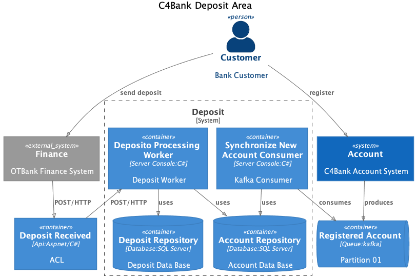
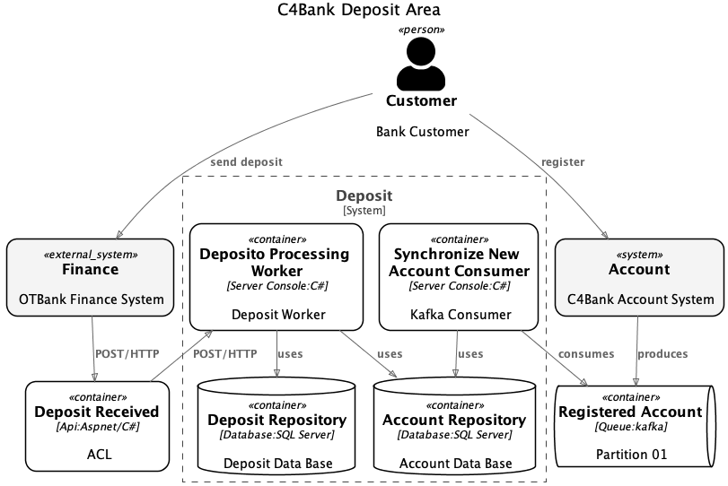
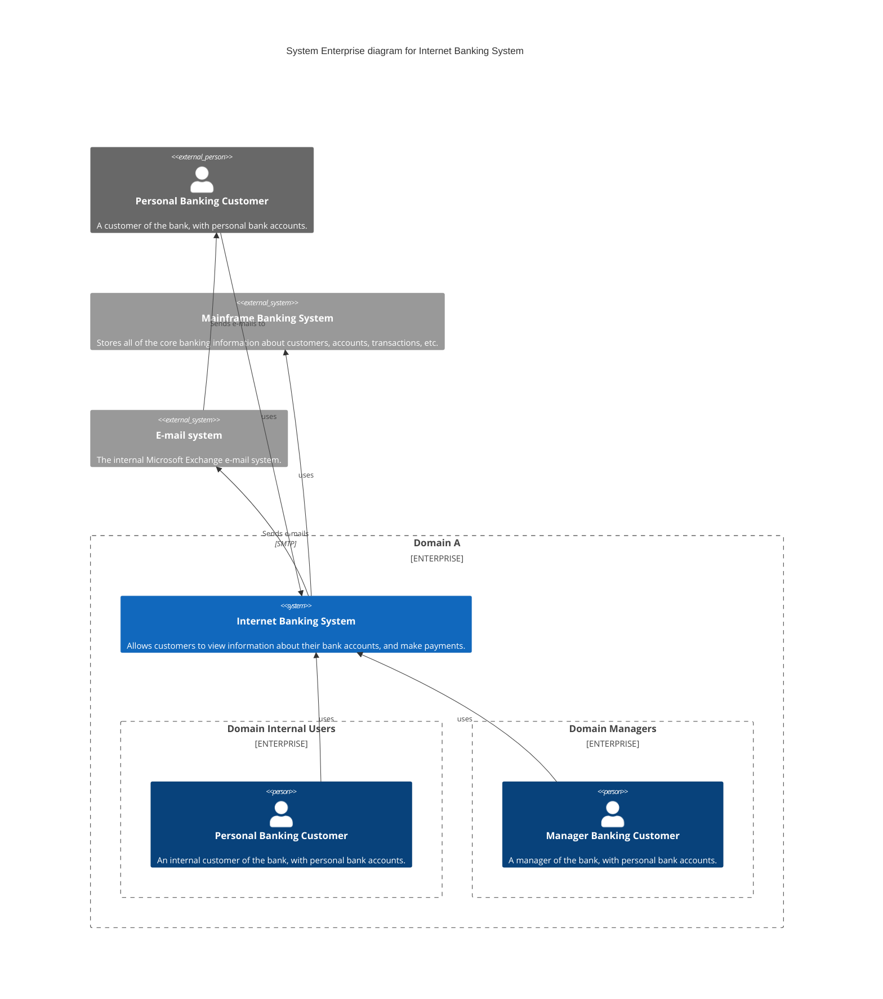

<p align="center">
  
</p>

C4Sharp (`C4S`) is a .net library for building diagrams as code, based on [C4 Model](https://c4model.com/). It works
like a superset of [C4-PlantUML](https://github.com/plantuml-stdlib/C4-PlantUML) through which developers can create,
share, and consume [C4 Model diagrams](https://c4model.com/) as code (C#) such as Context, Container, Component and
Deployment diagrams. The library generates the following diagram types: PNG, SVG, PUML, MERMAID

>[!NOTE]\
> The C4 model is an easy-to-learn, developer-friendly approach to software architecture diagramming. Good software architecture diagrams assist with communication inside/outside of software development/product teams, efficient onboarding of new staff, architecture reviews/evaluations, risk identification (e.g. risk-storming), threat modeling (e.g. STRIDE/LINDDUN), etc.  
> [SIMON BROWN](https://twitter.com/simonbrown)

>[!IMPORTANT]
> There are benefits to using these tools over the heavier alternatives, including easy version control and the ability to generate the DSLs from many sources. ools in this space that we like include Diagrams, Structurizr DSL, AsciiDoctor Diagram and stables such as WebSequenceDiagrams, PlantUML and the venerable Graphviz. It's also fairly simple to generate your own SVG these days, so don't rule out quickly writing your own tool either. One of our authors wrote a small Ruby script to quickly create SVGs, for example.    
> [Thoughtworks Technology Radar](https://www.thoughtworks.com/en-br/radar/techniques/diagrams-as-code)

# Getting Started

First, you will need the [.NET 5.0+](https://docs.microsoft.com/pt-br/dotnet/standard/net-standard)
and [Java](https://www.java.com/en/download/) to run C4Sharp. Also, you should install the C4Sharp package in your project.
This package is available through [Nuget Packages](https://www.nuget.org/packages/C4Sharp).

| Package | Description                          | Version                                                                                        | Downloads | Maintainability | Status |  
|---------|--------------------------------------|------------------------------------------------------------------------------------------------| ----- |----- |----- |
|`C4SHARP`| dotnet library for building diagrams | [](https://www.nuget.org/packages/C4Sharp) | [](https://www.nuget.org/packages/C4Sharp) | [](https://www.codacy.com/gh/8T4/c4sharp/dashboard?utm_source=github.com&amp;utm_medium=referral&amp;utm_content=8T4/c4sharp&amp;utm_campaign=Badge_Grade) | [](https://github.com/8T4/c4sharp/actions/workflows/dotnet.yml) |
|`C4SCLI` | cli for compiling C4S projects       | [](https://www.nuget.org/packages/c4scli)   | [](https://www.nuget.org/packages/c4scli) | [](https://www.codacy.com/gh/8T4/c4sharp/dashboard?utm_source=github.com&amp;utm_medium=referral&amp;utm_content=8T4/c4sharp&amp;utm_campaign=Badge_Grade) | [](https://github.com/8T4/c4sharp/actions/workflows/dotnet.yml) |

To build a diagram using the C4S library we need to identify the structures and their relationships through a class that inherits properties directly from DiagramBuildRunner. See the following example of building a container diagram:

```C#
namespace C4Bank.Deposit.Architecture;

public class ContainerDiagram : DiagramBuildRunner
{
    protected override string Title => "C4Bank Context of Deposit Area";
    protected override DiagramType DiagramType => DiagramType.Container;
    
    protected override IEnumerable<Structure> Structures => new Structure[]
    {
        new Person("Customer", "Customer", "Bank Customer"),
        new SoftwareSystem("OTBank.Finance", "Finance", "OTBank Finance System", Boundary.External),
        new SoftwareSystem("C4Bank.Account", "Account", "C4Bank Account System"),
        new Api<DepositReceived>("Aspnet/C#", "ACL"),
        new EventStreaming<RegisteredAccount>("kafka", "Partition 01"),
        
        SoftwareSystemBoundary.New("Deposit",
            new Api<DepositoProcessingWorker>("C#"),
            new Database<IDepositRepository>("SQL Server", "Deposit Data Base"),
            new ServerConsole<SynchronizeNewAccountConsumer>("C#", "Kafka Consumer"),
            new Database<IAccountRepository>("SQL Server", "Account Data Base")
        ),
    };

    protected override IEnumerable<Relationship> Relationships => new[]
    {
        It("Customer") > It("OTBank.Finance") | "send deposit",
        It("OTBank.Finance") > It<DepositReceived>() | ("POST", "HTTP"),
        It<DepositoProcessingWorker>() < It<DepositReceived>() | ("POST", "HTTP"),
        It<DepositoProcessingWorker>() > It<IDepositRepository>(),
        
        It("Customer") > It("C4Bank.Account") | "register",
        It("C4Bank.Account") > It<RegisteredAccount>() | "produces",
        It<SynchronizeNewAccountConsumer>() > It<RegisteredAccount>() | "consumes",
        It<SynchronizeNewAccountConsumer>() > It<IAccountRepository>(),
        It<DepositoProcessingWorker>() > It<IAccountRepository>(),
    };   
}
```

There are two strategies for compiling diagrams in your project: self-compiling and using the `C4SCLI` tool. 

#### a) self-compiling approach: 

```c#
internal static class Program
{
    private static void Main()
    {
        var diagrams = new[]
        {
            new ContainerDiagram().Build(),
        };
        
        new PlantumlSession()
            .UseDiagramImageBuilder()
            .UseDiagramSvgImageBuilder()
            .Export(diagrams);
    }
}
```
<small>see the complete code [here](./samples/Basic/C4Sharp.Sample/Program.cs)</small>

#### b) Using the C4SCLI tool:

> [!TIP]\
> The `C4SCLI` can be used in DevOps pipelines, removing the need to manually compile diagrams. For this, install `C4SCLI` tool and execute de the following command:
```shell
$ c4scli build <solution path> [-o <output path>]
```
see the following sample

```bash
$ mkdir assets
$ c4scli build /src/c4sharp.sln -o /c4
... 

C4 diagram PNG files
C4 diagram generated: file:////c4/internet-banking-system-api-application-c4component.png

C4 diagram SVG files
C4 diagram generated: file:////c4/internet-banking-system-api-application-c4component.svg

C4 diagram MD files
C4 diagram generated: file:////c4/internet-banking-system-api-application-c4component.mermaid.md

C4 diagram PUML files
C4 diagram generated: file:////c4/internet-banking-system-api-application-c4component.puml
```

>[!WARNING]
> only compatible with projects using c4sharp version 5.0+

The previous steps will result in the following image:



You can customize the diagram by implementing the SetStyle() method, as in the following example:

```c#
protected override IElementStyle? SetStyle()
{
    return new ElementStyle()
        .UpdateElementStyle(ElementName.Person, "#000000", "#000000")
        .UpdateElementStyle(ElementName.Container, "#ffffff", "#000000", "#000000", false, Shape.RoundedBoxShape)
        .UpdateElementStyle(ElementName.System, "#f4f4f4", "#000000", "#000000", false, Shape.RoundedBoxShape)
        .UpdateElementStyle(ElementName.ExternalSystem, "#f4f4f4", "#000000", "#000000", false, Shape.RoundedBoxShape);
}    
```



Now, C4Sharp can compile the [Mermaid](https://github.com/mermaid-js/mermaid) markdown file. For this, you should use the function `UseDiagramMermaidBuilder()`. The following code shows how to compile these files. 

```c#
      context
            .UseDiagramImageBuilder()
            .UseDiagramSvgImageBuilder()
            .UseDiagramMermaidBuilder()
            .Export(diagrams);
```
Using the code above you'll have the following result:



See the complete code [here](./docs/system-enterprise-diagram-for-internet-banking-system-c4context.mermaid.md).


# Learn
- See more in our [sample code](./samples):
- To learn more about `C4S` access our [wiki](https://github.com/8T4/c4sharp/wiki).

# Thanks

### C4 community

- 🌟 [Simon Brown](https://twitter.com/simonbrown)
- 🌟 [PlantUML Team](https://plantuml.com/)
- 🌟 [C4-PlantUML Team](https://github.com/plantuml-stdlib/C4-PlantUML)

### Contributors

- 🥇 [Alberto Monteiro](https://github.com/AlbertoMonteiro)
- 🥇 [Nino Dioses](https://github.com/Nino-Dioses)

### Colleagues

- 🤝 [Abraão Honório](https://www.linkedin.com/in/abraaohonorio)
- 🤝 [Daniel Martins](https://www.linkedin.com/in/daniel-de-souza-martins)
- 🤝 [Rafael Santos](https://www.linkedin.com/in/rafael-santos-0b51465)
- 🤝 [Marcus Vinicius Santana Silva](https://github.com/Lowpoc#marcus-vinicius-santana-silva-lowpoc-)

# Guide to contributing to a GitHub project

This is a guide to contributing to this open source project that uses GitHub. It’s mostly based on how many open sorce
projects operate. That’s all there is to it. The fundamentals are:

- Fork the project & clone locally.
- Create an upstream remote and sync your local copy before you branch.
- Branch for each separate piece of work.
- Do the work, write good commit messages, and read the CONTRIBUTING file if there is one.
- Push to your origin repository.
- Create a new PR in GitHub.
- Respond to any code review feedback.

If you want to contribute to an open source project, the best one to pick is one that you are using yourself. The
maintainers will appreciate it!
