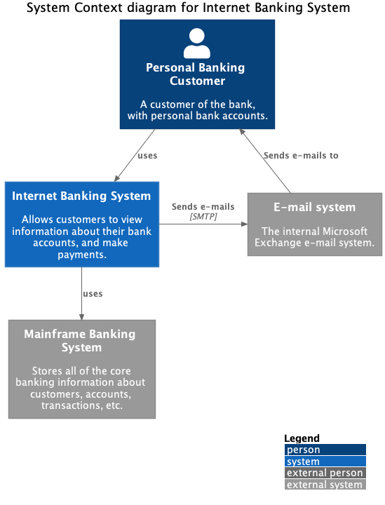

C4Sharp (C4S) is a simple .NET superset of [C4-PlantUML](https://github.com/plantuml-stdlib/C4-PlantUML) to generate [C4 Model diagrams](https://c4model.com/) as code (C#). It's used for building Context, Container, Component and Deployment diagrams.

## Getting Started

### Instalation
This package is available through Nuget Packages: https://www.nuget.org/packages/C4Sharp

| Package |  Version | Downloads |
| ------- | ----- | ----- |
| `Flunt` | [](https://www.nuget.org/packages/C4Sharp) | [](https://www.nuget.org/packages/C4Sharp) |


**Nuget**
```
Install-Package C4Sharp
```

**.NET CLI**
```
dotnet add package C4Sharp
```

### Dependencies

You need these things to run C4Sharp:
- [.NET Standard 2.1](https://docs.microsoft.com/pt-br/dotnet/standard/net-standard)
- [Java](https://www.java.com/en/download/)
- [Graphviz](https://plantuml.com/graphviz-dot) 


### Coding a C4 diagram

To build C4 Diagrams in C4S it's simple. Just use this following structure for all
diagrams:

```c#
var diagram = new <Diagram Type>
{
    Title = "...",
    Structures = new Structure[] { },
    Relationships = new Relationship[]{ }
};
```

For example, with C4S you can create a _C4 Context Diagram_, 
you could use this code:

```c#
/// A System Context diagram is a good starting point for diagramming and 
/// documenting a software system, allowing you to step back and see the 
/// big picture. Draw a diagram showing your system as a box in the centre,
/// surrounded by its users and the other systems that it interacts with.

var diagram = new ContextDiagram
{
    Title = "System Context diagram for Internet Banking System",
    Structures = new Structure[]
    {
        Customer,
        BankingSystem,
        Mainframe,
        MailSystem
    },
    Relationships = new []
    {
        (Customer > BankingSystem),
        (Customer < MailSystem)["Sends e-mails to"],
        (BankingSystem > MailSystem)["Sends e-mails", "SMTP"][Neighbor],
        (BankingSystem > Mainframe),
    }
};

PlantumlFile.Save(diagram);
PlantumlFile.Export(diagram);
```
It's executes _Save()_ and _Export()_, were creates two files:
- ./c4/System_Context_diagram_for_Internet_Banking_System_C4_Context.puml
- ./c4/System_Context_diagram_for_Internet_Banking_System_C4_Context.png

The result will be:

<div style="text-align: center">


</div>

## Learn

See more samples [here](https://github.com/8T4/c4sharp/tree/main/tests/C4Sharp.Tests/C4Model/Samples)


## Background

#### PlantUML

> [PlantUML](http://en.plantuml.com/) is an open source project that allows you to create UML diagrams.
> Diagrams are defined using a simple and intuitive language.
> Images can be generated in PNG, in SVG or in LaTeX format.
> PlantUML was created to allow the drawing of UML diagrams, using a simple and human readable text description.
> Because it does not prevent you from drawing inconsistent diagrams, it is a drawing tool and not a modeling tool.
> It is the most used text-based diagram drawing tool with [extensive support into wikis and forums, text editors and IDEs, use by different programming languages >and documentation generators](http://en.plantuml.com/running).

#### C4 model

> The [C4 model](https://c4model.com/) for software architecture is an "abstraction-first" approach to diagramming, based upon abstractions that reflect how 
> software architects and developers think about and build software.
> The small set of abstractions and diagram types makes the C4 model easy to learn and use.
> C4 stands for context, containers, components, and code — a set of hierarchical diagrams that you can use to describe your software architecture at different 
> zoom levels, each useful for different audiences.

## License

This project is licensed under the MIT License - see the [LICENSE](LICENSE) file for details
