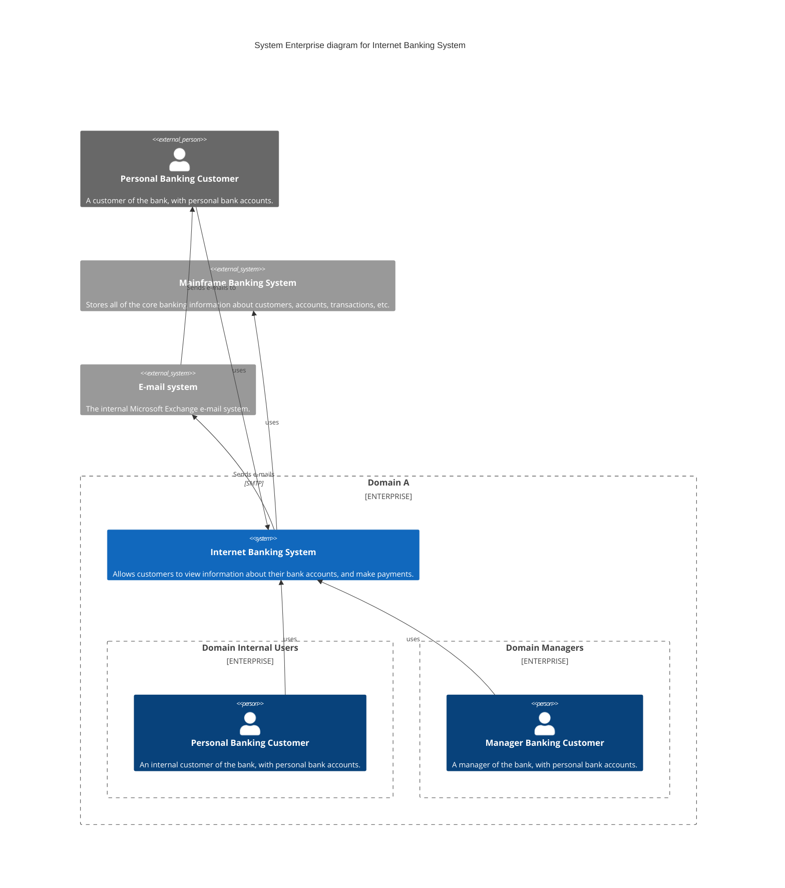

```mermaid
C4Context

title System Enterprise diagram for Internet Banking System

Person_Ext(customer, "Personal Banking Customer", "A customer of the bank, with personal bank accounts.")

Enterprise_Boundary(enterprise.boundary, "Domain A") {
    System(BankingSystem, "Internet Banking System", "Allows customers to view information about their bank accounts, and make payments.", $tags="services")
    
Enterprise_Boundary(enterprise.boundary.1, "Domain Internal Users") {
    Person(internalcustomer, "Personal Banking Customer", "An internal customer of the bank, with personal bank accounts.")
}

    
Enterprise_Boundary(enterprise.boundary.2, "Domain Managers") {
    Person(manager, "Manager Banking Customer", "A manager of the bank, with personal bank accounts.")
}

}

System_Ext(Mainframe, "Mainframe Banking System", "Stores all of the core banking information about customers, accounts, transactions, etc.")
System_Ext(MailSystem, "E-mail system", "The internal Microsoft Exchange e-mail system.")

Rel(customer, BankingSystem, "uses")
Rel(internalcustomer, BankingSystem, "uses")
Rel(manager, BankingSystem, "uses")
Rel_Back(customer, MailSystem, "Sends e-mails to")
Rel(BankingSystem, MailSystem, "Sends e-mails", "SMTP")
Rel(BankingSystem, Mainframe, "uses")
```
