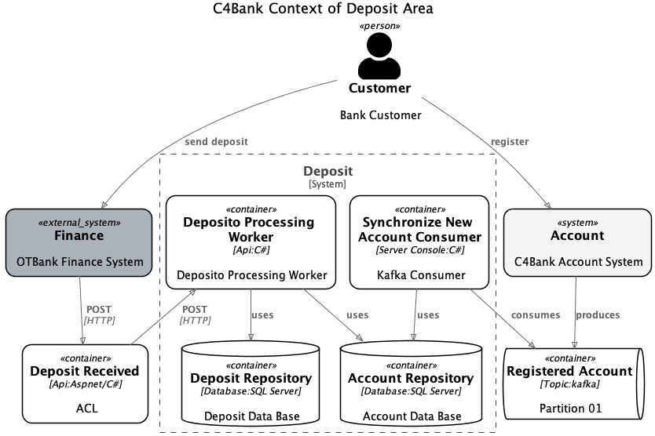
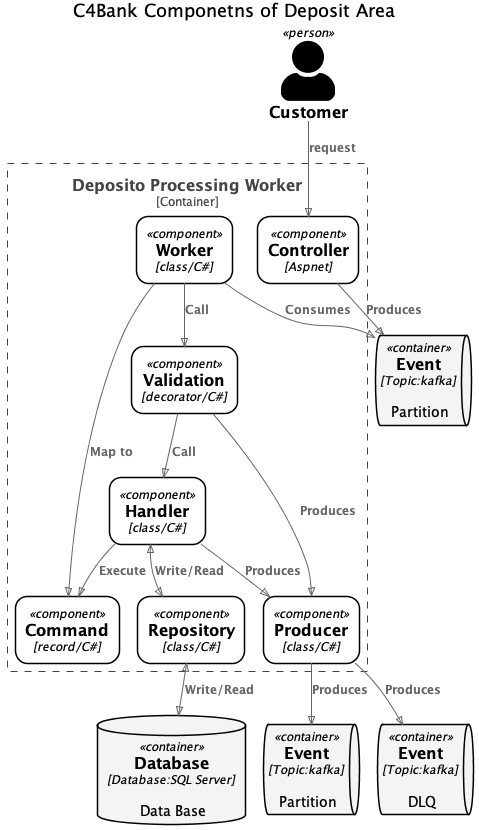

# C4Bank Sample
> ⚠️ **ATTENTION**! This example does not correspond to reality and has only the didactic purpose of teaching the use of C4SHarp functionalities. In this simulation, a fictitious bank deposit process is performed.

### Context Diagram
> A System Context diagram is a good starting point for diagramming and documenting a software system, allowing you to step back and see the big picture. Draw a diagram showing your system as a box in the centre, surrounded by its users and the other systems that it interacts with.

  
picture 1. Context Diagram  
see the code [here](../C4Bank/C4Bank.Deposit/Architecure/ContextDiagram.cs)

- Scope: A single software system.
- Primary elements: The software system in scope.
- Supporting elements: People (e.g. users, actors, roles, or personas) and software systems (external dependencies) that are directly connected to the software system in scope. Typically these other software systems sit outside the scope or boundary of your own software system, and you don’t have responsibility or ownership of them.
- Intended audience: Everybody, both technical and non-technical people, inside and outside of the software development team.
- Recommended for most teams: Yes.

### Container Diagram
>Once you understand how your system fits in to the overall IT environment, a really useful next step is to zoom-in to the system boundary with a Container diagram. A "container" is something like a server-side web application, single-page application, desktop application, mobile app, database schema, file system, etc. Essentially, a container is a separately runnable/deployable unit (e.g. a separate process space) that executes code or stores data.

  
picture 2. Container Diagram  
see the code [here]('../C4Bank/C4Bank.Deposit/Architecure/ContainerDiagram.cs')

- **Scope**: A single software system.
- **Primary** elements: Containers within the software system in scope.
- **Supporting** elements: People and software systems directly connected to the containers.
- **Intended** audience: Technical people inside and outside of the software development team; including software architects, developers and operations/support staff.
- **Recommended** for most teams: Yes.

Notes: This diagram says nothing about deployment scenarios, clustering, replication, failover, etc.

### Component Diagram
>The Component diagram shows how a container is made up of a number of "components", what each of those components are, their responsibilities and the technology/implementation details.

picture 3. Component Diagram  
see the code [here](../C4Bank/C4Bank.Deposit/Architecure/ComponentDiagram.cs)

- **Scope**: A single container.
- **Primary** elements: Components within the container in scope.
- **Supporting** elements: Containers (within the software system in scope) plus people and software systems directly connected to the components.
- **Intended** audience: Software architects and developers.
- **Recommended** for most teams: No, only create component diagrams if you feel they add value, and consider automating their creation for long-lived documentation.
